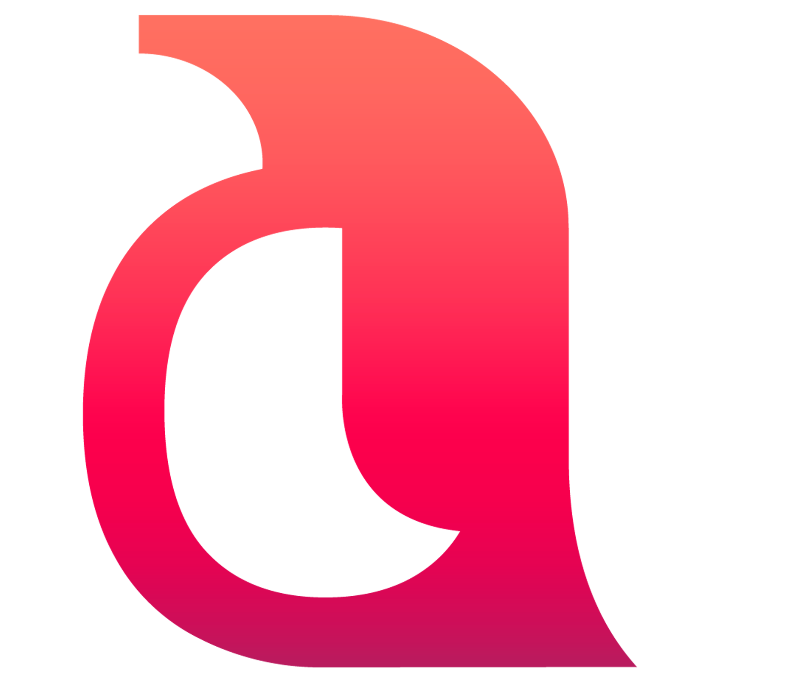

# PecegeSquads.com 

### DEV's :

| Equipe Frontend                                    | Equipe Backend                                  |
| -------------------------------------------------- | ----------------------------------------------- |
| [Angelo Lanche](https://github.com/AngeloLanch)    | [André Luiz](https://github.com/andreluizcosta) |
| [Estela de Oliveira](https://github.com/ste2021)   | [Marcelo](https://github.com/Marcelo316)        |
| [Harlley Bastos](https://github.com/harlleybastos) | [Nikolas Ferraz](https://github.com/)           |

`Objetivo do projeto`

### O projeto do Pecege Squads é desenvolver um site que atenda o projeto PECEGE SQUADS.

`Descrição do PECEGE SQUADS`

### O Pecege Squads, uma ideia original do Instituto PECEGE, consiste em um projeto de integração entre os colaboradores do Instituto PECEGE, promovendo amizade e compartilhamento de vivências e experiências, através de Peceger's que possuem gostos e talentos em comum, reforçando o companheirismo, tornando o ambiente de trabalho mais leve.

`Requisitos Necessários`

- [x] Node
- [x] NPM
- [x] Uma IDE de sua preferência, aqui trabalhamos com VSCode;

`Tecnologias Utilizadas`

- [x] HTML 📗
- [x] CSS 📘
- [x] [Javascript](https://developer.mozilla.org/pt-BR/docs/Web/JavaScript/) 🗂
- [x] [React](https://pt-br.reactjs.org/) ⚛

## Pontos a melhorar no projeto

- [x] Melhorar o código 💿
- [x] Melhorar o Design 💿

## Para rodar o projeto

### `cd Squads`

### `yarn`

### `yarn start`

#### Referências:

- [x] [CSS Gradient](https://cssgradient.io/)
- [x] [Maujor](https://www.maujor.com/)
- [x] [CSS Tricks](https://css-tricks.com/almanac/)
- [x] [React](https://pt-br.reactjs.org/)

### Desenvolvido por PECEGE ®
